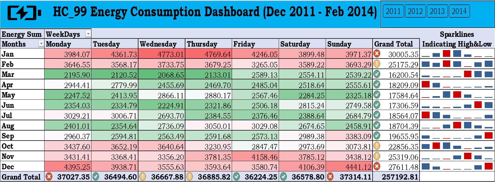

# Power-Usage-Data-Analysis-and-Dashboard

### Introduction
In this project, I conducted a comprehensive analysis of power usage data using MS SQL. By leveraging various SQL queries and also made a dashboard that updates with new data influx, I gained valuable insights into energy consumption patterns and trends.

### Data Source
The power usage data was sourced from the table `[hc_99$]` in the `[samdutse].[dbo]` schema.

### Dashboard


### MS SQL Findings
Here are the key findings from the SQL queries:

1. Viewing First Top 10 Rows of Data:
   - SQL Query:
     ```sql
     SELECT TOP 10 *
     FROM [samdutse].[dbo].[hc_99$]
     ```
   - Description: This query displays the first 10 rows of the power usage data, providing a glimpse into the dataset.

2. Grouping Energy Consumption by LCLid (Household):
   - SQL Query:
     ```sql
     SELECT
         LCLid,
         ROUND(SUM(energy_sum), 2) AS Total_Energy_Consumed,
         ROUND(AVG(energy_sum), 2) AS Avg_Energy_Consumed
     FROM
         [samdutse].[dbo].[hc_99$]
     GROUP BY
         LCLid
     ORDER BY
         Total_Energy_Consumed DESC
     ```
   - Description: This query calculates the total and average energy consumed for each household (LCLid), providing insights into high and low energy consumers.

3. Count of Records for Highest and Lowest Energy Consumption:
   - SQL Queries:
     ```sql
     -- Highest Energy Consumption
     SELECT COUNT(*) AS High_LCLid_Count
     FROM [samdutse].[dbo].[hc_99$]
     WHERE LCLid = 'MAC000249';

     -- Lowest Energy Consumption
     SELECT COUNT(*) AS Low_LCLid_Count
     FROM [samdutse].[dbo].[hc_99$]
     WHERE LCLid = 'MAC003096';
     ```
   - Description: These queries retrieve the count of records for the households with the highest and lowest energy consumption, providing additional context to the analysis.

4. Top and Bottom Energy Consumers:
   - SQL Queries:
     ```sql
     -- Top 10 households with the highest total energy consumption
     SELECT TOP 10
         LCLid,
         ROUND(SUM(energy_sum), 2) AS total_energy_consumption
     FROM
         [samdutse].[dbo].[hc_99$]
     GROUP BY
         LCLid
     ORDER BY
         total_energy_consumption DESC;

     -- Top 10 households with the lowest total energy consumption
     SELECT TOP 10
         LCLid,
         ROUND(SUM(energy_sum), 2) AS total_energy_consumption
     FROM
         [samdutse].[dbo].[hc_99$]
     GROUP BY
         LCLid
     ORDER BY
         total_energy_consumption ASC;
     ```
   - Description: These queries identify the top 10 households with the highest and lowest total energy consumption, offering insights into outliers and energy usage patterns.

5. Energy Consumption by Year, Month, and Weekday:
   - SQL Queries:
     ```sql
     -- Total and average energy consumption by year
     SELECT
         DATEPART(YEAR, day) AS Year,
         ROUND(SUM(energy_sum), 2) AS total_energy_consumption,
         ROUND(AVG(energy_sum), 2) AS Average_Energy_Consumption
     FROM
         [samdutse].[dbo].[hc_99$]


     GROUP BY
         DATEPART(YEAR, day)
     ORDER BY
         Average_Energy_Consumption DESC;

     -- Total and average energy consumption by month
     SELECT
         DATEPART(MONTH, day) AS Month,
         ROUND(SUM(energy_sum), 2) AS total_energy_consumption,
         ROUND(AVG(energy_sum), 2) AS average_energy_consumption
     FROM
         [samdutse].[dbo].[hc_99$]
     GROUP BY
         DATEPART(MONTH, day)
     ORDER BY
         average_energy_consumption DESC;

     -- Total and average energy consumption by weekday
     SELECT
         DATEPART(WEEKDAY, day) AS Weekday,
         ROUND(SUM(energy_sum), 2) AS total_energy_consumption,
         ROUND(AVG(energy_sum), 2) AS average_energy_consumption
     FROM
         [samdutse].[dbo].[hc_99$]
     GROUP BY
         DATEPART(WEEKDAY, day)
     ORDER BY
         average_energy_consumption DESC;
     ```
   - Description: These queries analyze energy consumption patterns by year, month, and weekday, providing insights into seasonal variations and specific days with higher or lower energy usage.

### Conclusion
By analyzing the power usage data using MS SQL, I uncovered valuable insights into energy consumption trends. These findings can inform decision-making processes and potential energy optimization strategies.
